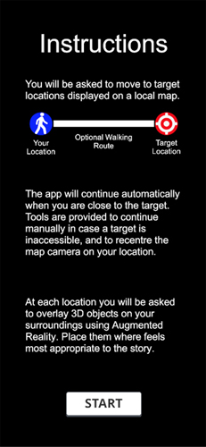

# Map Story - An AR location-based story/game engine for Unity

Map Story is an Augmented Reality location story/game engine available as a Unity project. Two versions of the project are available for download, each set up to  build for either iOS or Android mobile phones capable of supporting AR through the phone camera. This means iPhones (6S and later) and most non-lite models of Android handsets.

The story engine allows you to quickly create a location-based experience for use anywhere, with the app detecting suitable nearby sites to visit and incorporate as desired. The app will continue automatically on arriving at each real world location shown on a local map, asking the user to interact with virtual models overlaid on the surroundings using AR, before continuing on to the next site. The engine offers a template to personalise according to your own story or game, adding appropriate virtual models for each location visited, alongside scripts representing your desired interactions with them.

Each of the GameObjects is numbered to help you set up the project in the Inspector window, in case it is not correctly set up when opening the **MapStory** project scene that contains the app templates.

## Table of contents
1. [Quick start guide](#quickstart)
2. [Example gameplay](#gameplay)
3. [Sections of the story engine](#sections)
4. [Making your own location-based AR story](#makingyourownstory)
5. [Creating your own AR object interactions](#ARinteractions)
6. [Building your project](#buildingyourproject)
7. [Acknowledgements](#acknowledgements)
8. [Contact](#contact)

## Quick start guide 
Before opening the project make sure that you have the required plugins installed and are using a suitable version of Unity. These are outlined in [Before starting](#sections).
Despite the Map Story engine just consisting of a series of blank templates for each page of the app, a finished app can be built and uploaded to a mobile phone quickly to demonstrate the app's features. The steps to achieve this are as follows:
1. Load the appropriate iOS or Android Unity project according to which device you want to use the app on.
2. Enter your personal Mapbox ID under Unity's Mapbox menu (*Mapbox -> Setup*). If you do not have an ID already you can sign up for one for free through [Mapbox](https://account.mapbox.com/auth/signup/).

3. Click on the **SearchLocalSites_12** GameObject in the Hierarchy window and locate its *SearchLocationsScript* in the Inspector. Here you will need to enter:

&nbsp; - The number of different real world locations the user will be asked to visit during the story.

&nbsp; - The maximum play area specified as a radius in metres (a multiple of 50), around the user's starting location.

&nbsp; - Your personal Google Places key to connect to the API and search for local Points Of Interest (POIs). 

If you do not have one already you can sign up at [Google Maps](https://developers.google.com/maps). Make sure that the Places API is added to your Google project associated with the key.

4. Select the **StoryManager_15** GameObject and its *StoryManager* script in the Inspector. You have the option of leaving the *Guided Story* variable checked or unchecked. By ticking the *Guided Story* variable the user will be guided to each POI on a local map based on the shortest walking route between the POIs identified for them to visit. If the variable is unchecked, the user will be able to select which POI to walk to next from a local map.

5. Find the **SiteAudio_17** GameObject in the Hierarchy which contains the audio tracks as child gameObjects, that will play as the user is walking to each POI. The number of children must match the number of POIs to be visited set in step 2, with each child GameObject having an associated *AudioSource* script attached to it. To get up and running quickly you can duplicate the attached **AudioTemplate** GameObject to the required number that contains a *jingle* audio track attached to it.

6. Locate the **ObjectsToPlace_16** GameObject, where each child represents one of 3D models to be overlaid on the user's surroundings through AR, at each POI visited. The number of children must therefore match the number of POIs set in stage 3. To get started quickly you can duplicate the existing child object **3DCubePrefab** to the required number, though for your own projects you will want to create your own objects and interactions with them. The **3DCubePrefab** offers a simple example interaction through its attached *ObjectInteractionScript*.

7. Build the project using the existing project settings, though you should assign your own choice of bundle identifier and name for your project.
8. On starting the app on an appropriate device, you will need to allow access to both location services to identfy the user's position, as well as the phone's camera to enable the app's AR features. You will be prompted to do this when the app first starts.

## Example gameplay 
Map Story offers a template for you to create your own AR location-based stories and games. The templates provided are described on the following pages, with this section outlining how gameplay currently operates.
1. On starting the app, it will search for a number of named locations around the user's detected GPS position. These identified Points Of Interest (POIs) will act as the real world locations the user needs to visit, with the place names able to be incorporated into the experience if desired.
2. The nearest of these these locations will be displayed on the map alongside a marker showing the user's current position. The user will also be provided with an optional route to walk to the target that will update as they move. On arriving at the target the story will continue automatically, with an option also provided to trigger it to continue manually, in case the target is inaccessible due to obstacles in the real world preventing them getting close enough.
3. At each target location, the app will change to a view through the user's phone camera, where they will be asked to hold up their phone to place a virtual object on top of their surroundings through Augmented Reality. A bespoke interaction can be included with each object, requiring the user to complete it in order to continue.
4. The user will then continue to visit the other locations in their local area, similarly placing and interacting with virtual objects. Map Story can either be setup to allow all the locations to be visited in the order that will minimise the overall walking distance, or allow the user to select the next location to visit from those identified on the map of their local area.
5. After visiting the pre-selected number of locations, an ending or closing screen is provided before exiting the app.

## Sections of the story engine 
Each section of the Map Story engine is designed to be fully customisable according to your own story or game, including adding new sections between those included. The current parts of the existing engine are as folllows including how to set-up the Unity project when you first start:

### Before starting
The Map Story Unity projects included for both iOS and Android were created in Unity 2019.2.11f1 so you will want to make sure you are running that or a newer version. You will also need to make sure you have the relevant packages installed that are required to run the project. These are as follows:

1. **ARFoundation** and **ARSubsystems** Version 3.1.3 &mdash; Allows the placement of virtual objects through Augmented Reality in the phone camera view, using SLAM tracking to align them to the physical surroundings.
2. **ARKit XR Plugin** Version 3.0.4 &mdash; AR implementation primarily used for iOS devices.
3. **ARCore XR Plugin** Version 3.1.4 &mdash; AR implementation primarily used for Android devices.
4. **XR Management** Version 3.0.6 &mdash; Manages XR plugin implementation.
4. **Json.NET for Unity** Version 10.0.302 &mdash; Provides a JSON framework used to receive data from the Google Places API.

Map Story is built using a modified version of the Mapbox for Unity SDK, which is included in the Unity projects. The Mapbox API is used for its map and navigation tools, so to build the app you will be required to enter a valid Mapbox ID. This is entered on the Mapbox setup menu added to the Unity menu by the SDK (*Mapbox -> Setup*).

Your Mapbox ID can also be with the online [Mapbox studio](https://www.mapbox.com/mapbox-studiosoftware) software to create a customised map that best suits the theme of your story or game. After designing the look of your map using the software and your public Mapbox ID, you will be provided with a Style URL that can be entered on the *Abstract Map* script of the **ARAlignedMap** GameObject, under the Image section. This will add this map styling to your Map Story project.

### Title page
The **TitlePanel_1** GameObject contains a blank template to create a title page for your project. When the app is started a button will appear to search for a selected number of local named locations/POIs, that the user will be required to visit as part of the experience.

The POIs are identified through the Google Places API, this search handled by the **SearchLocalSites_12** GameObject and its associated *SearchLocationsScript*. When creating your own experience you will need to set three values on this script in the Inspector. The first entry determines the number of real world locations that the user will be required to visit. The Places API must therefore detect at least this many local sites, those selected according to their prominence rating. This search will be performed in a selected radius around the GPS position where the user selects to load the app. To perform this search using the API you will need a valid Google Places API key.

Variables to set:
- *No Locations To Visit* &mdash; The number of real world locations to visit as part of your project.
- *Search Radius* &mdash; The radius of the search area in metres to look for local sites. The number should be a multiple of 50.
- *API Key* &mdash; Your Google Places API key must be entered in order to connect to the API and search for suitable map sites.
- 

### Instructions page
**InstructionsPanel_2** is the GameObject providing a template to offer appropriate instructions for how to use your app. A basic set of instructions is included describing gameplay whereby a user's real world position is displayed on a map alongside a target to walk to, with a suggested walking route to get there provided by the **Directions** GameObject and its associated *DirectionsWalking* script. This navigation tool is taken from the Mapbox SDK and will update in real time as the user moves. The instructions template also makes mention of the map tools included, such as a button to recentre the camera on the user's location, as well as a button to trigger the story to continue manually in case it is difficult for the user to reach the target location. Instructions for how to place virtual objects using AR may also be provided here, though you will wish to customise all these instructions according to your own project.

### Warning page
By necessity the app will require the user to move around public spaces, and so it is important to offer a warning reminding them to take care when required to cross roads, as well as to respect other members of the public. The **WarningPanel_3** GameObject offers a template to provide such a warning. Though the app offers audio whilst walking to the next target location, the app aims to keep the user safe by not requiring them to focus on their phone screen whilst moving. Instead they should only be encouraged to look at their phone display when stationary, at which point they may be asked to place and interact with virtual content at their current location.

### Story manager
The **StoryManager_15** GameObject and its attached *StoryManager* script deals with the set-up and progression between the different stages of the app, including checking when a user has arrived at or triggered the next location. During the script's set-up phase, it examines the list of local locations identified by the Google API, and selects those to use for the story based on their metatags and sufficient spacing from the other selected locations. The names of each of the real world locations to be visited is stored, so that they can be incorporated into your story or game. 
After selecting the POIs to visit based on the *No Locations To Visit* variable set on the *SearchLocations* script, the shortest walk is initially plotted between them. This route and POI order will be adopted if the *Guided Story* checkbox is set to true. Alternatively if this variable is left unchecked, the user will be able to select which location they want to visit next from the local map. Selecting whether to leave this box checked or unchecked will be driven by the particular type of story or game that you are looking to create.

Variables to set:
- *Guided Story* &mdash; If checked, the user will be led between each map POI based on the shortest walk between them. If left unchecked, the user will be asked to select which target location on the map they want to walk to next.

### Story audio
An audio track will play as the user is walking to the next target location. These audio tracks must be listed as children of the **SiteAudio_17** GameObject, with each child having an associated *AudioSource* script and audio track attached to it.
If the *GuidedStory* box is checked on the *StoryManager* script, these child audio tracks will be played in order, with the first track played whilst walking to the first POI and so on. If *GuidedStory* is unchecked, the order each audio track is played will vary according to the POI the user selects to visit. For example, if they select to visit the third POI, then the third audio track will be played as they walk to it.

Please Note:
- The number of child GameObjects on the **SiteAudio_17** GameObject must match the *No Locations To Visit* variable on the *SearchLocations* script for the app to work correctly. Each child also reqiures an *AudioSource* script and audio track to be set on it.

### Map tools
A set of tools for use with the map are provided. The map can be scrolled and pinched to zoom in or out. Additionally, if the user loses track of their map location, a button is provided to recentre the map directly above their current real world position. A second button is also provided to trigger the story to continue manually in cases where they are unable to reach their target. This may occur because the target is inaccessible from being placed on private land or due to temporary roadworks, or if the target ends up being somewhere that the user would does not want to visit. If the story is continued manually, the user will just be asked to overlay the next virtual object at their current position. 
In the case where the *Guided Story* variable is set to false, before walking to the next target the user will currently be asked to select their next target location to visit from those remaining, by touching its marker on the map. On doing so a suggested walking route will be shown on the map.

### Location story details
After arriving at the next POI, a template **SiteInfoPanel_7** GameObject is included that offers potential to provide the user with an introduction to that section of the story or game, as well as an outro after completing the interaction with the associated 3D object overlaid there. The information you want to display here as part of the intro and outro will depend on the particular story or game that you are looking to create. It is also possible to reference the name of the current real world POI here, accessible through the *SiteName_Text_7_3* Text object. To summarise this section, the *Intro_Text_7_4* Text will be displayed on first arriving at the target location, before placing a 3D object there using AR, with the *Outro_Text_7_5* Text displayed after any interaction with it, and before heading to the next location.

### Placing 3D objects
At each location visited, the user is asked to overlay a virtual model on top of their surroundings using AR, with the potential to code and offer a bespoke interaction with each object before moving on to the next location. Placing these objects is currently handled by the *PlaceObject* script attached to the **PlaceObjectPanel_9** GameObject. After placing each 3D model using AR, a set of direction buttons are provided to more closely position the object against the user's surroundings. You may wish to provide instructions within your story to encourage the user to look for a suitable place in their surroundings to position each object,

After coding your own bespoke object interactions, you will need to modify the *ContinueApp* method in this script to activate your bespoke interaction scripts, rather than activating the *ObjectInteractionScript* currently referenced. This script offers a simple example interaction with the the **3DCubePrefab** GameObject for those following the quick start guide.
The **ObjectsToPlace_16** GameObject should contains the 3D models that the user will be asked to place at each site visited as its children. Please note that the top level of each child GameObject should contain a *Renderer* script to display the object, as well as your bespoke interaction script. 
If the *GuidedStory* box is checked on the *StoryManager* script, each child GameObject will be placed in order, with the first child placed after visiting the first POI and so on. If *GuidedStory* is unchecked, the order each virtual object is placed will vary according to the POI the user selects to visit. For example, if they select to visit the third POI, the 3D model placed will be the third child listed under the **ObjectsToPlace_16** GameObject.

Please Note:
- The number of child GameObjects to **ObjectsToPlace_16** must match the *No Locations To Visit* variable on the *SearchLocations* script for the app to work. Any bespoke interactions you create with the objects must be also referenced accordingly in the *PlaceObject* script and attached to the relevant child.

### Ending
After visiting all the pre-selected locations, the number set according to the *No Locations To Visit* variable on the *SearchLocations* script, the user will currently reach the end of the app. A simple ending template is provided with the **EndingPanel_10** GameObject and its associated *Ending* script. This basic script allows you to add an optional audio track to the *EndingAudio* variable that will play at this point before the user is asked to close the app. Again you will want to customise this page according to your particular project, perhaps linking to a credits page that lists those who were involved in making your project.

## Making your own location-based AR project 
Map Story contains the basic framework to allow you to create your own location-based story or game, that will direct users between a number of identified local POIs within a set *Search Radius* (a variable on the *SearchLocationsScript*), around the position where the user first loaded the app. The number of locations they will be required to visit can be set using the *No Locations To Visit* variable on the *SearchLocationsScript*. You will also want to decide whether the user should be guided between the locations and the 3D objects placed at each one in a pre-determined order, or whether the user is able to select which location to visit next, affecting the particular 3D object they will place there. This considerations will depend on the particular story or game you are looking to create, with the option set via the *Guided Story* tickbox on the *StoryManager* script.
You will also want to consider whether you have adopted a consitent theme throughout your project in terms of the 3D objects selected to place, the choice of story, and the styling of the map and pages presented throughout the app. The map can be styled according to your theme using the online [Mapbox studio](https://www.mapbox.com/mapbox-studiosoftware) software, used together with your public Mapbox ID. Once you have created your own map styling you can use this within your project by selecting a Custom *Data Source*, and entering †he unique *Style URL* on the *Abstract Map* script of the **ARAlignedMap** GameObject, under the Image section.
The templates provided are only offered as a guide, you may wish to add further pages according to the particular project you are looking to create, with the scripts included easily adjustable to enable you to do this, with comments in the code describing the role of each variable and method currently included. Some example projects created with the Map Story engine are shown in the following photo.

## Creating your own AR object interactions 
As part of your own app you may want to allow the user to interact with the virtual objects they overlay on their surroundings at each location visited. Various possibilities for interacting with them are possible, such as tied to using a phone's touchscreen or identifying movement through its accelerometer. These interactions will depend on the particular 3D models you have chosen to place, in which case you will also need to create an appropriate script for the object to handle the interaction. 
A comment has been left where this may be done in the *PlaceObjects* script, replacing the existing call to enable the *ObjectInteractionScript*, which is associated with the **3DCubePrefab** GameObject, for use with the quick start guide. This script demonstrates a simple interaction with the Rubik cube prefab designed to get you up and running quickly. After placing the cube object at the user's position, they are then asked to spin the cube using the phone's touhscreen, which will cause the Rubik cube to become solved, each face becoming a single colour. This example interaction is shown in the photo below. The user is then asked to touch the red face of the cube to continue, presenting the site's outro page, before directing them to the next location.
The type of interactions you can offer is only limited by your imagination and will depend on the particular story or game you are looking to create.

## Building your project 
The build settings (*Edit -> Project Settings...*) of both the iOS and Android versions of the Unity project have been set-up to allow you to quickly build each project for a suitable mobile phone capable of supporting AR through the phone camera. However, it is suggested that you set the Project Name (*Project Settings... -> Player*) and Bundle Identifier (*Project Settings... -> Player -> Other*) according to your personal project.

Please Note:
If building to iOS you may be required to make the following change to the *ARSessionNative.mm* file built by Unity before opening it in Xcode. This is a recent bug, with the change outlined preventing the Xcode build failing with the following error:
'''
Cannot initialize a parameter of type 'id<NSCopying> _Nonnull' with an rvalue of type 'Class'
'''
To fix this open your project folder built from Unity and locate the *ARSessionNative.mm file* (*Libraries -> Mapbox -> UnityARKitPlugin -> Plugins -> iOS -> UnityARKit -> NativeInterface*). Make the following changes in a text editor and save, both occur in a single instance:
1. *forKey:[ARPlaneAnchor class]* should be changed to *forKey:(id<NSCopying)[ARPlaneAnchor class]*
2. *forKey:[ARAnchor class]* should be changed to *forKey:(id<NSCopying)[ARAnchor class]*

## Acknowledgements 
Map Story is built on top of the Mapbox for Unity SDK, which is included as part of the Unity project. It also makes use of the Google Places API, with the example 3D model and audio files included as part of the Quick Start project, consisiting of the following resources, used under a CC-BY license:
- Rubik cubes by krabz (Blend Swap)
- JinglePiano by Jonesbrt (freesound)

## Contact 
If you have any questions or difficulties using Map Story, please feel free to get in contact and I will get back to you with a response. You can contact me at <mapstory2ar@gmail.com>.
